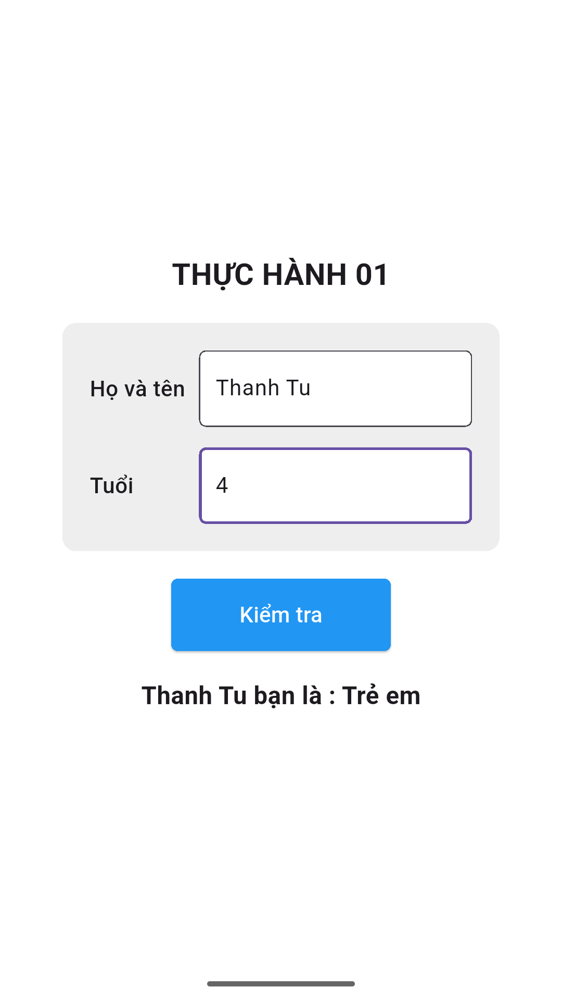

# thuchanh01

Bài Thực Hành 1 Tuần 1
- Tạo một màn hình đơn giản để nhập tên và tuổi, sau đó hiển thị thông tin và kiểm tra người đó là Người già (>65), Người lớn (6-65) | trẻ em (2-6) | em bé (>2)

## Ảnh Demo

